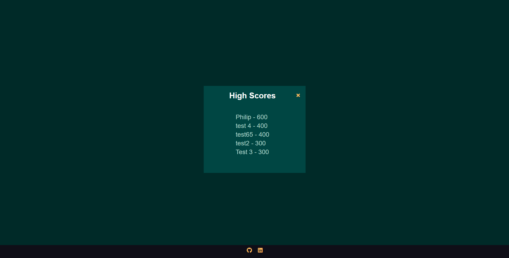
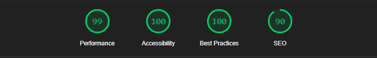
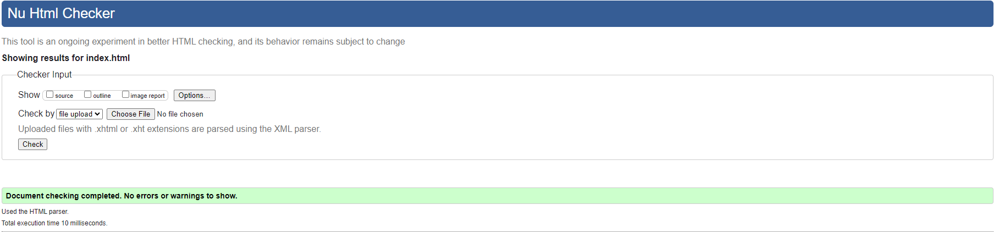

# A History Quiz Game - Javascript
Developer: Philip Jambrisak


[View Live Website Here](https://jambrisak.github.io/My-JavaScript-Project/)

This is A History Game created as Portfolio project #2 (JavaScript Essentials) for Diploma in Full Stack Software Development at [Code Institute](https://codeinstitute.net/se/full-stack-software-development-diploma/).
It is an interactive front-end quiz app where user can test their knowledge about History. The application is easy to use for the user,
it is responsive across a range of devices and incorporates best practices regarding design and accesibility.

The project purpose is a presentation of interactive data. The site should respond to the users actions allowing users to actively
engage with data, alter the way the site displays the information to achieve their preferred goals.

## Table of content
1. [Project](#project)
	- [Strategy/Scope](#strategy-scope)
	- [Site Owner Goals](#site-owner-goals)
    - [Site User Goals](#site-user-goals)
2. [User Experince(UX/UI)](#user-experience)
	- [Colour Scheme](#colour-scheme)
    - [Typography](#typography)
	- [Structure](#structure)
3. [Technology](#technology)
    - [Languages used](#languages-used)
    - [Frameworks, libraries & software used](#frameworks-libraries-software-used)
4. [Testing](#testing)
    - [Accessibility](#accessibility)
    - [Performance](#performance)
    - [Validation](#validation)
    - [HTML](#html)
    - [CSS](#css)
    - [JavaScript](#javascript)
    - [Browser compatibility](#browser-compatibility)
    - [Platforms/devices](#platforms-devices)
    - [Bugs](#bugs)
    - [Responsiveness](#responsiveness)
    - [Peer Review](#peer-review)
5. [Deployment](#deployment)
6. [Credits](#credits)
    - [Learning resources](#learning-resources)
    - [Acknowledgements](#acknowledgements)

## Project
### Strategy/Scope
A History Game Quiz Game is an entertainment app inteded for users who wanna test their History knowledge. 
The quiz contains questions with various difficulty level, that encourages user to replay the game if he/she dosen't achieve maximum
score in the first run.

The content is presented on a single page that interactively changes content depending on the users actions. The **primary goal**
is to entertain the user during the game. The **secondary objective** is to improve the users knowledge about History. With this in mind,
does the application provide the users a feedback after each game.

To achieve the strategy goals I implemented following features:
- Simple website layout with the content located in the center of the viewport.
- Easy to click buttons both on computres and mobile touch interfaces.
- Intuitive game interface that presents important information and controls in a clear way.
- Visual feedback to users actions.
- Eye-pleasing graphics to make the experience entertaining.

### Site owner goals
- Provide entertaining and an interactive experience for the users.
- Provide a game app with questions with various difficulty level.
- Provide a link to linkedin and the project's GitHub repository, to interest users in the project and to obation new followers.
- To provde a website that looks well across a range of devices and screen sizes.

### User goals
As a user I want to:
- Navigate easy throughout the page.
- See clean interface and be able to track progress/score.
- Know how many questions I have left to answer.
- Receive feedback for given answers.
- Learn somthing new about History.
- Enjoy the game.
- See my score after I answer the last question.
- Be able to re-play the game without using "back" button in the browser.
- Follow the developer in social media.
## User Experience (UX/UI)
### Colour Scheme
Colour palette was selected using [Happy Hues](https://www.happyhues.co/) and has applied to the recomended UI elements.

For best readability and clean look was #004643 used for the background of the quiz. The buttons was given the colour of #f9bc60
and the text colour for the buttons was given #001e1d. For the headline the colour of ##fffffe was chosen because against the background,
that colour was best because it stood out against that background.

When the user gets the right answer in the quiz the colour of #28a745 and when the answer is incorrect they are shown the colour #dc3545.
### Typography
- The [Roboto](https://fonts.google.com/specimen/Roboto/tester) is the font used throughout the whole website with Sans-serif as the
fallback. The Roboto font is clean, modern looking and it is easy to the eyes. It is sourced from [Google Fonts](https://fonts.google.com/)
and it is imported in the CSS document via @import.

### Structure
Wireframes
I created Wireframes to help me visualize the design for the site and have a template to use when I started to build the site sections. 
- Home page [view](assets/docs/wireframesHomePage.png) 
- Game page [view](assets/docs/wireframesGamePage.png)
- End Page  [view](assets/docs/wireframesEndPage.png)


The page is designed in a very simple way. All pages shares the same colour palette and the content is located in the center of the screen.
The content is changed dynamicaly by JavaScript.

### Start screen
The main menu was designed to provide an introduction to the application via an attractive logo and heading. 
All menu options are presented in this element with the Play button allowing new visitors to start a quiz immediately. 
And the highscore button for users who wanna see the current highscore. There is also a button that will take you back to my portfolio website.


### Game page
The game page is designed to give clear information about what question the user is answering, and which are the choices.
It is also designed to give the user information about his/hers current score, and how many questions the user has answered.


### High Score Modal
The highscore modal was designed to be a template for all other modals. 
It details how previous users have scored. 
This modal can be closed using its close button or by clicking an area outside of the element.


### Heads Up Display
The heads up display was designed to show how far along the user is with the quiz, and how many questions the user have answered.
It was also designed to show current score.


### Questions
The questions is randomly selected each time the user plays the game, and is shown between the choices and heads up display.


### Visual feedback for correct and incorrect answer.
The choices is designed to show when the user gets the correct choice or the incorrect choice. The buttons also have a hover effect to show the user which button their mouse is on.
)


### Score page
When the quiz ends, the score of the game shows up and the user will be prompted to save the score and his/hers username.
The user also have a choice to play the quiz again or go back to the home page.


### Future Development
- Utilise more features of the API
    - The API offers a feature to generate and use a session token to prevent duplicate questions appearing until all have been exhausted from the database. I would like to utilise this to avoid repeated questions.
    - The API Database contains True or False questions and I would like to incorporate these in the quiz as currently this application only uses multiple choice questions.
- Leaderboard
    - Results are only displayed at the end of the quiz with no option to share or track progression over the session. I would like to implement a high score table where users could compare the number of questions they answered (per session) against each other.
- Statistics
    - More information could be gathered from the play session of a user such as their best and worst categories to further track progress and development.
- Sounds
    - Would be used to notify users of certain game events and help bring the application to life.
- Feedback form/prompts
    - This would allow users to submit bug reports and allow the collect of information regarding the questions content. The feedback would be reviewed and if valid later submitted to the API creator to help improve the questions database.
- Timer
    - Due to time constraints I dropped the implementation of a question timer. I would like to implement this in the quiz at a later stage to track total time taken per game, total time spent playing per session and to add a countdown per question to add urgency.
- Code Re-write
    - The quiz would benefit from a redesign based on everything I learnt throughout the development of this first version. I would focus on program flow earlier and how certain defensive checks could be made earlier e.g.
    - The API exposes how many questions are available in each category. The form elements in the settings menu could be dynamically constrained based on this information. This would require the quiz to utilise all types of questions as mentioned in the first point of this section.


## Technology
### Languages Used
- [HTML5](https://en.wikipedia.org/wiki/HTML5)
- [CSS3](https://en.wikipedia.org/wiki/CSS)
- [JavaScript ES6](https://en.wikipedia.org/wiki/JavaScript)
- [Markdown - language used to write this document.](https://en.wikipedia.org/wiki/Markdown)

### Frameworks, libraries & software used
- [Balsamiq](https://balsamiq.com/) - Balsamiq was used to create wireframes during the design process.
- [Coolers.co](https://coolors.co/) - Was used to find a colour palette.
- [Google Fonts](https://fonts.google.com/) - Google Fonts were used to import the 'Roboto' font into the app.css file which is used on all pages throughout the project.
- [Font Awsome](https://fontawesome.com/) - Font Awsome was used on all pages throughout to add icons for the footer.
- [Git](https://git-scm.com/) - Git was used for version control by utilizing the Gitpod terminal to commit to Git and Push to GitHub.
- [GitHub](https://github.com/) - GitHub is used to store the projects code after being pushed from Git.
- [VS Code](https://code.visualstudio.com/) - IDE used to code the project.
- [Gimp](https://github.com/) - GIMP was used to edit and resize photos for the readme.
- [Am i Responsive](https://ui.dev/amiresponsive) - Online tool used to create mockup to present responsive design of this project.
- [Lightshot](https://app.prntscr.com/en/index.html) - Google Chrome extension used to capture screenshots for this README document.
- [Lighthouse](https://web.dev/measure/?gclid=CjwKCAjwzNOaBhAcEiwAD7Tb6HRAAz5BpsJHUTZjbUjVem1pf9IRxhdD_eaBsI6zUzFgKYOPNUNYnhoCbuoQAvD_BwE) - Google WebDev tool used for performance/accesibility testing.
- [Icons8](https://icons8.com/icons/set/History) - Tool used to create favicon / Logo.
- [Opentdb.com](https://opentdb.com/) - Where i got my API DB for my questions.

The following Visual Studio Code extensions were utilized in the production of this project:
- [Beautify](https://marketplace.visualstudio.com/items?itemName=HookyQR.beautify) - Used for code formatting.
- [Rewrap](https://marketplace.visualstudio.com/items?itemName=stkb.rewrap) - Used to wrap comments and site text.
- [Code Spell Checker](https://marketplace.visualstudio.com/items?itemName=streetsidesoftware.code-spell-checker) - Used to spell check content and commits.
- [Live Server](https://marketplace.visualstudio.com/items?itemName=ritwickdey.LiveServer) - Used to provide a locally hosted live preview of the site during development.
- [jshint](https://marketplace.visualstudio.com/items?itemName=dbaeumer.jshint) - JSHint is a linter for JavaScript.
- [indent-rainbow](https://marketplace.visualstudio.com/items?itemName=oderwat.indent-rainbow) - Makes indentation easier to read.
- [markdownlint](https://marketplace.visualstudio.com/items?itemName=DavidAnson.vscode-markdownlint) - Markdown linting and style checking for Visual Studio Code.

## Testing

### Performance
[Lighthouse](https://app.prntscr.com/en/index.html) - Google webdev tool used for performance testing showing near-maximum score.
- Desktop

- Mobile


### Validation
#### HTML5
- [W3c Markup Validator](https://validator.w3.org/#validate_by_upload+with_options) - Validation service used.
#### index.html
In the Index.html no faults were shown and the HTMl code were green.

#### game.html
In the Game.Html some faults were shown and i can explain why they are no faults in the real sense.
- Error: Duplicate ID hud-item. This shows up because im using two hud-item id's. And that's because Im dividing up the hud in two parts.
- Warning: The first occurrence of ID hud-item was here. - Same as above.
- Warning: Empty heading. Its sayin that my h2 tag is empy which it is because thats the part i fill in with questions from my JS.

#### end.html
In the End.html some faults are also shown and as I can with game.html I can also explain theese faults.
- Warning: Empty heading. It shows that for my h1 final score tag, that its empty which is true. But this tag takes the info from JS about the users score and shows it here.
- Info: Trailing slash on void elements has no effect and interacts badly with unquoted attribute values. This I will have fixed by the time this is shown. But incase its still there I will let you see the error.
- Error: Attribute href not allowed on element button at this point. I get two of theese, and it tells me that the button can't have an href attritbute. But that's somthing no one says on the internet, because alot of people use buttons to go to a diffrent page or section.


#### CSS3
- [W3C CSS Validator](https://jigsaw.w3.org/css-validator/#validate_by_upload) - Validation service used.
#### app.css
In the W3C CSS validator check for app.css no faults are detected.

#### game.css
In the W3C CSS validator check for game.css no faults are detected.


#### JavaScript ES6
[JS Hint](https://jshint.com/)
- No warning or errors reported using the VSCode extension.
- No warning or errors reported using JSHint website when using the following parameters (entered at the top of the code section):
```// Use ECMAScript 8 
//jshint esversion:8
// Tell JSHint the currentQuiz global variable
// can be overwritten
/*global currentQuiz:true */
```

### Browser compatibility
Website was tested manually on following browsers:
- Google Chrome.
- Edge.
- Firefox.
- Safari.
- Opera/Opera GX.
The results were satisfactory on all browsers.

### Platfroms/devices
Website was tested manually on:
- Apple Iphone X
- Apple Ipad.
- Apple MacBook Air.
- Samsung Galaxy Tab S7+
- Ultrawide display 3440x1440.
- Classic 16:9 2560x1440 display.
The results were satisfactory and proved good responsiveness on all screen sizes.

### Bugs
I only encountered one bug when the site was around 70% built and it was the linkes between pages, after multiple tries I could
sort it out and found out that the page, has a problem when the user is using an adblocker. 
After trying out a different adblockers I found out that the only adblocker that made the site not work was this.
[AdBlock](https://chrome.google.com/webstore/detail/adblock-%E2%80%94-best-ad-blocker/gighmmpiobklfepjocnamgkkbiglidom)
I could not find a way around this and therefore I recommend users to disable this adblocker or choose a different one.


### Responsiveness
I confirmed that this website is responsive and all the functions are displayed correctly.
#### 320px
#### 568px
#### 768px
#### 1024px
#### 1920px
#### 2560px

### Per review
I aksed my friends and fellow CI students to test the application and I recived a lot of positive feedback, one issue was noticed
and it was that the text for questions and answers displayed some bugs.
Thanks to the feedback I implemented a new DB that shows no bugs in the text for either the questions or answers.


## Deployment
The project was deployed to GitHub Pages using the following steps:
- Log in to GitHub and locate the [quiz-game]() repository.
- Locate the "Settings" button on the menu.
- Scroll down the settings page until you locate "Pages" in "code and automation" section.
- Under "Source", click the dropdown called "Select branch:" and select "Main", clickt he dropdown called "Select folder" and select "/root".
- The page will automatically refresh and you receive message "Your site is published at ["https://jambrisak.github.io/My-JavaScript-Project/"]().
Result is below.

### Fork
If you want to fork this project with the intent to propose changes to the developer. It's good practive to regularly sync your fork with the original repository.
To do this, you'll need to use Git on the command line. 
- On GitHub.com, navigate to the [https://github.com/Jambrisak/My-JavaScript-Project](https://github.com/Jambrisak/My-JavaScript-Project) repository.
- In the top-right corner of the page, click **Fork**.
image
- Select an owner for the forked repository.
image
- By default, forks are named the same as their parent repositories. You can change the name of the fork to distinguish it further.
image
- Optionally, add a description of your fork.
image
- Choose wheter to copy only the default branch or all branches to the new fork. For many forking scenarios, such as contributing to open source projects, you only need to copy the default branch. By default only the default branch is copied.
image
- Click **Create fork**
image

#### Cloning your forked repository
Right now, you have a fork of the My-JavaScript-Project repository, but you do not have the files in that repository locally on your computer.
- On Github.Com, navigate to your fork of the My-JavaScript-Project repository.
- Above the list of files, click **Code**.
image
- Copy the URL for the repository.
    - To clone the repository using HTTPS, under "HTTPS".
    - To clone the repository using an SSH key, including a certificate issued by your organization's SSH certificate authority, click SSH.
    - To clone a repository using GitHub CLI, click GitHub CLi.
- Open Git Bash.
- Change the current working directory to the location where you want the cloned directory.
- Type git `git clone`, and then paste the URL you copied earlier. It will look like this, with your GitHub username instead of `YOUR-USERNAME`: 
```$ git clone https://github.com/YOUR-USERNAME/My_JavaScript_Project```
- Press **Enter**. Your local clone will be created.
```$ git clone https://github.com/YOUR-USERNAME/Spoon-Knife
> Cloning into `Spoon-Knife`...
> remote: Counting objects: 10, done.
> remote: Compressing objects: 100% (8/8), done.
> remote: Total 10 (delta 1), reused 10 (delta 1)
> Unpacking objects: 100% (10/10), done.
```
## Deployment
The project was deployed to GitHub Pages using the following steps:
- Log in to GitHub and locate the [quiz-game]() repository.
- Locate the "Settings" button on the menu.
- Scroll down the settings page until you locate "Pages" in "code and automation" section.
- Under "Source", click the dropdown called "Select branch:" and select "Main", clickt he dropdown called "Select folder" and select "/root".
- The page will automatically refresh and you receive message "Your site is published at ["https://jambrisak.github.io/My-JavaScript-Project/"]().
Result is below.

### Fork
If you want to fork this project with the intent to propose changes to the developer. It's good practive to regularly sync your fork with the original repository.
To do this, you'll need to use Git on the command line. 
- On GitHub.com, navigate to the [https://github.com/Jambrisak/My-JavaScript-Project](https://github.com/Jambrisak/My-JavaScript-Project) repository.
- In the top-right corner of the page, click **Fork**.
image
- Select an owner for the forked repository.
image
- By default, forks are named the same as their parent repositories. You can change the name of the fork to distinguish it further.
image
- Optionally, add a description of your fork.
image
- Choose wheter to copy only the default branch or all branches to the new fork. For many forking scenarios, such as contributing to open source projects, you only need to copy the default branch. By default only the default branch is copied.
image
- Click **Create fork**
image

#### Cloning your forked repository
Right now, you have a fork of the My-JavaScript-Project repository, but you do not have the files in that repository locally on your computer.
- On Github.Com, navigate to your fork of the My-JavaScript-Project repository.
- Above the list of files, click **Code**.
image
- Copy the URL for the repository.
    - To clone the repository using HTTPS, under "HTTPS".
    - To clone the repository using an SSH key, including a certificate issued by your organization's SSH certificate authority, click SSH.
    - To clone a repository using GitHub CLI, click GitHub CLi.
- Open Git Bash.
- Change the current working directory to the location where you want the cloned directory.
- Type git `git clone`, and then paste the URL you copied earlier. It will look like this, with your GitHub username instead of `YOUR-USERNAME`: 
```$ git clone https://github.com/YOUR-USERNAME/My_JavaScript_Project```
- Press **Enter**. Your local clone will be created.
```$ git clone https://github.com/YOUR-USERNAME/Spoon-Knife
> Cloning into `Spoon-Knife`...
> remote: Counting objects: 10, done.
> remote: Compressing objects: 100% (8/8), done.
> remote: Total 10 (delta 1), reused 10 (delta 1)
> Unpacking objects: 100% (10/10), done.
```
## Credits
### Learning resources
- [Code Institute](https://codeinstitute.net/se/full-stack-software-development-diploma/?utm_term=code%20institute&utm_campaign=CI+-+SWE+-+Search+-+Brand&utm_source=adwords&utm_medium=ppc&hsa_acc=8983321581&hsa_cam=14660337051&hsa_grp=134087657984&hsa_ad=581817633086&hsa_src=g&hsa_tgt=aud-594467886660:kwd-319867646331&hsa_kw=code%20institute&hsa_mt=e&hsa_net=adwords&hsa_ver=3&gclid=CjwKCAjwzNOaBhAcEiwAD7Tb6N3WGiztlBSEN8Er4wdekcvAJ_KwB8GUz1PJfQssgnTLnMNScuTcghoC8-UQAvD_BwE) - The JavaScript section and walthrough project helped me alot in getting the knowledge needed.
- [W3C School](https://www.w3schools.com/) - When Code Institute could not give me the answer.
- [JavaScript and JQuery: Interactive Front-End Web Development by Jon Duckett](https://www.adlibris.com/se/bok/javascript-jquery---interactive-front-end-web-development-9781118871652) - When I needed to repeat or just see whatelse I could try when I was stuck.

### Acknowledgements
- My mentor Maranatha Ilesanmi for helpful feedback and guidance at all stages of the project.
- Niclas Tanskanen for being an amazing bouncing idea partner and an amazing tester.
- My girlfriend Maja Jönsson, for putting up with me working alot with my project and supplying me with coffee and snacks.

### Disclaimer
- A History Quiz was created for educational purposes only.